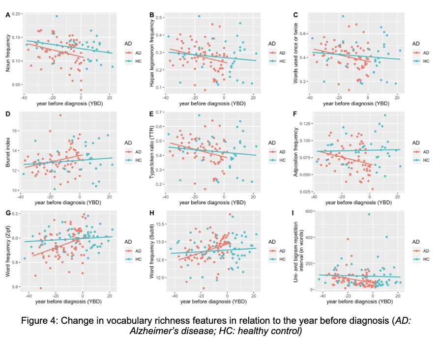

# Generating a Synthetic Longitudinal Dataset for Alzheimer's Disease Research

## Codebase relevant folders and files:

| Item | Description |
|:-----|:------------|
| **Dementia deteration v2.chatmode.md**<br>`.github/chatmodes/Dementia deteration v2.chatmode.md` | Contains the custom chatmode for generating dementia stories |
| **Healthy aging.chatmode.md**<br>`.github/chatmodes/Healthy aging.chatmode.md` | Contains the custom chatmode for generating healthy aging stories |
| **extract_nlp_features.py**<br>`utils/extract_nlp_features.py` | Functions for extracting linguistic features from the generated text |
| **AD detection.ipynb**<br>`scripts/detection_model/AD detection.ipynb` | Notebook for evaluating the generated stories using an AD detection model |
| **multi_groups_analysis.ipynb**<br>`scripts/analyze/multi_groups_analysis.ipynb` | Notebook for analyzing linguistic features across different persona groups |
| **pitt_linguistic_analysis_notebook.ipynb**<br>`pitt_linguistic_analysis_notebook.ipynb` | Notebook for comparing linguistic features with the Pitt Corpus |
| **Personas**<br>`personas/` | Generated personas in JSON format |
| **Stories**<br>`stories/` | Generated stories in JSON format by different experiment dates |
| **Results**<br>`results/` | Evaluation results and visualization images |

Final story data are located in `stories/data_oct_6/healthy` and `stories/data_oct_10/dementia` directories.
--- 
## Table of Contents
1.  [Abstract](#abstract)
2.  [Methodology](#methodology)
    - [Persona and Core Memory Creation](#1-persona-and-core-memory-creation)
    - [Story Generation with a Custom Agent](#2-story-generation-with-a-custom-agent)
3.  [Evaluation and Results](#evaluation)
    - [AD Detection Model](#1-ad-detection-model)
    - [Comparison with losst-ad Research](#2-comparison-with-losst-ad-research)
    - [Linguistic Feature Comparison (Pitt Corpus)](#3-linguistic-feature-comparison-pitt-corpus)
4.  [Conclusion and Future Work](#4-conclusion-and-future-work)
5.  [Additional Documents](#additional-documents)

## Abstract

This project aimed to create a synthetic longitudinal dataset simulating the speech patterns of individuals with Alzheimer's Disease (AD). The dataset comprises 10 distinct personas, each with a series of six stories. These stories represent a core memory retold at various ages, with a designated age for the onset of AD. The primary objective was for the language model to reflect linguistic and cognitive deterioration in the stories generated for ages post-diagnosis. For instance, if a persona's deterioration age is 69, subsequent stories are expected to exhibit more pronounced linguistic markers associated with AD.

## Methodology

The workflow was divided into two main phases: persona creation and story generation.

### 1. Persona and Core Memory Creation

The foundation of our dataset is a set of 10 distinct, richly detailed personas. Drawing inspiration from the [TinyTroupe](https://github.com/microsoft/TinyTroupe) schema, we used a dedicated prompt to create each persona as a JSON file. These files encapsulate a wide range of attributes for each character, including:

*   **Demographics:** Name, age, and gender.
*   **Narrative Identity:** A detailed `persona_summary`, personal `background`, and life `goals`.
*   **Psychological Profile:** `beliefs`, `personality_traits`, and current `mental_state`.
*   **Clinical Anchor:** A specific `start_deterioration_age` to mark the onset of cognitive decline for the dementia group.

This structured approach ensured that the language model had a deep and consistent character profile to draw from. After initial experiments, we found that generating varied yet coherent stories required a narrative anchor. To solve this, we introduced a `core_memory` for each persona - a significant life event that serves as the thematic basis for all their stories. This core memory was added as a field to each persona's JSON file, providing a stable foundation for the agent to build upon for each generated story.

### 2. Story Generation with Copilot Custom Agent

Our process for generating stories evolved significantly through experimentation:

1.  **Initial Approach:** We began by using the ChatGPT UI with the GPT-4o model. However, this method proved to be unscalable and required extensive manual intervention.

2.  **Transition to Automation:** To streamline the process, we transitioned to using a Copilot agent. We developed a custom agent specifically designed for our story generation task.

3.  **Model Comparison:** We benchmarked several large language models available through Copilot and found that **Claude 4 Sonnet** and **Gemini 2.5 Pro** delivered the most satisfactory results.

4.  **Custom Agent Configuration:** The custom agent was equipped with a master prompt that outlined its capabilities and constraints. It was granted access to relevant files, including:
    *   An example schema of the desired JSON output.
    *   Knowledge files containing facts about Alzheimer's disease.
    *   The persona files and their corresponding core memories.

5.  **Prompt Engineering:** A significant portion of our work involved refining the master prompt to improve the quality of the generated stories. We employed techniques such as **Few-Shot Learning** (providing examples of desired outputs) and **Chain of Thought** (instructing the model to break down its reasoning process). The prompt also included a validation step to ensure each generated story met our predefined requirements.

<br><br>


## Evaluation

To validate the quality and authenticity of our synthetic dataset, we conducted a three-part evaluation. For every evaluation, we used a control group of stories generated from the same personas but without the AD diagnosis, allowing for a direct comparison between "healthy" and "dementia" narratives.

### 1. AD Detection Model

We employed a `bert-base-uncased` model, fine-tuned for Alzheimer's disease classification, to assess our generated stories. This model analyzes a given text and outputs a probability score for two classes: Control (healthy) and AD.

For each persona, we processed their stories chronologically. The model's predictions allowed us to track the probability of AD as the persona aged. We observed that for personas with a defined `start_deterioration_age`, the model's predicted probability for AD significantly increased in the stories generated for subsequent years, aligning with our project's goal of simulating cognitive decline. We visualized this progression by plotting the AD probability against the years since the onset of deterioration, which clearly demonstrated the model's ability to detect the linguistic changes introduced by our custom agent.


*Figure 1: AD probability progression for the dementia group, showing an increase after the designated start of deterioration.*


*Figure 2: AD probability progression for the healthy control group, showing stable, low probabilities over time.*

### 2. Comparison with LoSST-AD Research

We also compared the extracted linguistic features from our dataset against the findings reported in the [LoSST-AD](https://aclanthology.org/2024.lrec-main.944.pdf) research paper. This served as an additional benchmark to ensure our synthetic data aligns with established linguistic markers of Alzheimer's disease found in other scientific literature.

As part of this comparison, we used **nine linguistic features**, chosen for their relevance in indicating cognitive decline:
1. **Noun Token Ratio:** Proportion of nouns, indicating semantic content.  
2. **Hapax Legomena Ratio:** Frequency of words used only once, a measure of lexical richness.  
3. **Dis Legomena Ratio:** Frequency of words used once or twice.  
4. **Brunet's Index:** A measure of lexical diversity, robust to text length.  
5. **Type-Token Ratio (TTR):** Ratio of unique words to total words.  
6. **Adposition Frequency:** Frequency of prepositions and postpositions.  
7. **N-Gram Repetitions:** Repetitive use of unigrams and bigrams, a sign of disfluency.  
8. **Word Frequency (SUBTL):** Average word frequency based on the SUBTL database.  
9. **Word Frequency (Zipf):** Average word frequency based on the Zipf scale.  

*Figure 3: Linguistic feature comparison from Ulla & Anna's study.*


*Figure 4: Linguistic feature comparison from our synthetic dataset.*


### 3. Linguistic Feature Comparison (Pitt Corpus)

A core part of our evaluation was a detailed linguistic analysis comparing our synthetic data to the well-established Pitt Corpus.
We performed statistical tests (t-tests, Cohen's d) to compare the feature distributions between the control and disease groups within our synthetic dataset, and also between our synthetic data and the Pitt Corpus.

The results showed that our synthetic data mirrored many of the linguistic patterns observed in the real-world Pitt Corpus data, with several features showing statistically significant differences between the healthy and dementia groups in the same direction as the Pitt data. This provides strong evidence for the linguistic validity of our generated dataset.


*Figure 5: Detailed feature-by-feature comparison between the Pitt Corpus and our synthetic story data.*

<br>


*Figure 6: Visualization of mean differences in linguistic features between the Pitt and our synthetic datasets for both control and disease groups.*

The results of all evaluations are available in the project's source code, including detailed Jupyter notebooks: 
- `AD detection.ipynb`
- `multi_groups_analysis.ipynb`
- `pitt_linguistic_analysis_notebook.ipynb`


### 4. Conclusion and Future Work

#### Conclusion
This work highlights the value of realistic synthetic data that aims to supplement clinical trials. Though challenging, with proper guidance, LLMs can help model Alzheimer’s progression and pre-symptomatic stages, potentially improving quality of life through early detection of the disease.

#### Future Work
- Expand the dataset to include hundreds of personas and stories.
- Validate the dataset with AD experts.

---

### Additional Documents

<details>
<summary>Example Persona: <code>Lisa.json</code> (Click to expand)</summary>

```json
{
    "Persona": {
        "name": "Lisa Carmen Alvarez",
        "age": 60,
        "gender": "Female",
        "persona_summary": "Lisa is a passionate and resilient chef known for her bold flavors, intuitive cooking, and deep respect for culinary tradition. \
            With decades of experience running her own neighborhood bistro, she blends the soulful recipes of her Cuban-American upbringing with a creative, modern flair. \
            Her kitchen is both a sanctuary and a stage-where love, memory, and discipline come to life in every dish.",
        "goals": [
            "To publish a cookbook that preserves her family's traditional recipes while sharing stories of her culinary journey.",
            "To mentor young women in the restaurant industry, especially those from immigrant families.",
            "To open a small teaching kitchen for community cooking classes after retirement."
        ],
        "background": "Born in Miami to Cuban immigrants, Lisa grew up in a lively, food-centered household where meals were sacred gatherings. \
            She began cooking professionally in her early twenties, working her way through kitchens in New Orleans, New York, and finally settling in Chicago. \
            There, she opened her own Cuban-fusion bistro, which became a local institution over 25 years. \
            Lisa raised two sons while managing the demands of restaurant life, and now lives in a modest home filled with cookbooks, herbs on every windowsill, and framed photos of family and food. \
            She is a widow and maintains close ties to her extended family and culinary peers.",
        "mental_state": "Lisa remains intellectually and emotionally vibrant, though she's become more reflective as she slows down physically. \
            She occasionally battles with the aches of an aging body and the bittersweetness of handing off the kitchen reins. \
            Nevertheless, she's filled with purpose and retains a sharp sense of humor, especially in the company of fellow cooks and longtime regulars.",
        "example_dialogue": "\"You can't rush a sofrito-like you can't rush trust. Let it simmer. Let the flavors talk to each other. That's how you feed a soul, not just a stomach.\"",
        "beliefs": [
            "Food is memory made edible.",
            "You don't need fancy ingredients to make something unforgettable-just heart and patience.",
            "The kitchen is a place of respect, rhythm, and constant learning.",
            "Women belong in leadership roles in every corner of the food world."
        ],
        "personality_traits": [
            "passionate",
            "disciplined",
            "warm",
            "wise",
            "witty",
            "maternal",
            "resilient"
        ],
        "start_deterioration_age": 69,
        "core_memory": "A handoff dinner built around her mother's ropa vieja reinterpretation marked the moment she shifted from executor to steward. \
            Slow sofrito, braised flank, sensory teaching—showing Maribel the spoon line in sauce and the sweet pepper threshold—became a living transfer of craft. \
            A guest's quiet praise and the calm post‑service hush sealed the realization that tradition could be entrusted without diluting its soul."
    }
}
```
</details>

<details>
<summary>Dementia V2 Agent Configuration (Click to expand)</summary>

The custom agent used for generating dementia stories was configured with detailed instructions for progressive cognitive decline simulation. Below is the complete agent configuration:

```markdown
---
description: 'Alzheimer disease story retelling generator - Creates progressive dementia stories from personas core memory'
tools: ['changes', 'codebase', 'editFiles', 'problems', 'runCommands', 'search', 'searchResults', 'terminalLastCommand', 'terminalSelection']
---
data_dir = "stories/data_oct_10/dementia"

Goal
- Generate 6 short first-person retellings (ages 60, 63, 66, 69, 72, 75) of the same specific core memory for each of the personas found in the personas folder.
- Write the result to <data_dir>/<Persona.name>.json, matching example.json's structure exactly.

Inputs
- Personas files: personas folder at repo root.
- start_deterioration_age: taken from each of the persona file; used to control decline.
- example.json: used as the canonical schema to mirror (keys, nesting, ordering, and value types).

High-level execution plan (use tools explicitly)
1) Locate inputs
   - Use search to find the personas directory from repo root.
   - List files in personas (search or codebase). Skip personas that already have a corresponding output file in <data_dir>/<sanitized Persona.name>.json.
   - Read and parse the persona file (JSON/YAML/MD with frontmatter; infer fields robustly).
   - Use search to find example.json (stories/example.json). If not found, fail with a clear error.

2) Extract required fields
   - Persona.name (required): if missing, fail with a clear error.
   - start_deterioration_age (optional): if missing, default to 66.
   - Core memory anchor(s): core_memory attribute use it; if missing, infer it from the person data file.

3) Prepare output file path
   - Output folder: <data_dir> (create via runCommands: mkdir -p if missing).
   - Output filename: sanitize Persona.name to kebab-case ASCII, strip unsafe chars, suffix .json (e.g., "John Doe" → "john-doe.json").

4) Mirror schema from example.json
   - Read example.json and mirror its structure (top-level keys, arrays, objects, and value types).
   - Do not add extra fields not present in example.json.
   - Only replace content values; preserve key order and shapes.

5) Generate stories (content rules — definitive)

Global constraints
- Ages (exactly 6): 60, 63, 66, 69, 72, 75.
- Perspective: first-person, spoken style.
- Same core event and setting across all ages; no diagnosis language.
- Temperature ≤ 0.5, top_p ≤ 0.9. If a seed is available, set it for reproducibility.
- Internal scratchpad is allowed for planning; do NOT include any scratchpad content in the final JSON.

5.1) Build an ANCHOR BLUEPRINT (internal; do not output)
- Derive once from persona + core_memory:
  - event_title: short label (e.g., "Deer on Route 15").
  - place: one concrete location (e.g., "kitchen," "Route 15," "the small pier").
  - time_anchor: one concrete time signal (e.g., "early morning," "June," "after dinner").
  - participants: 1–3 roles (e.g., "my wife Sarah," "my brother").
  - salient_object_or_action: one nucleus (e.g., "silver locket," "tow truck," "burnt pie").
  - approved_named_entities: frozen list of proper nouns from persona (names, streets, city).
- Use these anchors consistently. Later retellings omit rather than contradict. No new proper nouns beyond the approved list.

5.2) Vocabulary control
- Draft the age‑60 story first. Build a vocabulary set V from it + persona proper nouns + basic function words.
- Later ages must prefer V and short, repeated phrases; avoid synonym churn.
- Target type–token ratio (TTR) ceilings by age:
  - 60: ≤ 0.45
  - 63: ≤ 0.42
  - 66: ≤ 0.38
  - 69: ≤ 0.34
  - 72: ≤ 0.30
  - 75: ≤ 0.28

5.3) Word counting rule
- Count words using regex boundary `\b[\w'']+\b`. Count "uh", "um", "mm", "yeah" as words. Ignore punctuation sequences (e.g., "...", "—") for word counts.

5.4) Length targets (inclusive of hesitations)
- Age 60: 130–150 words
- Age 63: 110–140 words
- Age 66: 90–120 words
- Age 69: 70–100 words
- Age 72: 55–85 words
- Age 75: 50–70 words

5.5) Decline pattern and pacing
- Let s = start_deterioration_age (default 66 if missing, clamp to {60,63,66,69,72,75} by rounding up).
- From age ≥ s: story length is strictly monotonically decreasing.
- Detail density (mentions of anchors) is non‑increasing with age.
- Hesitation rate increases with age (see 5.6).

5.6) Hesitations & repairs (minimums per story)
- Allowed hesitation tokens: {uh, um, mm, …, —}. Repairs include simple restarts ("I, I…", "I started… no, I").
- Minimum counts by age:
  - 60: ≥ 2 hesitations OR 1 repair
  - 63: ≥ 3 hesitations OR 1–2 repairs
  - 66: ≥ 4 hesitations OR 2 repairs
  - 69: ≥ 6 hesitations OR 3 repairs
  - 72: ≥ 8 hesitations OR 3–4 repairs
  - 75: ≥ 10 hesitations OR 4 repairs
- Include at least one soft admission of uncertainty after age 66 (e.g., "I don't remember," "I got mixed up"), increasing in frequency with age. Do not mention any diagnosis.

5.7) Consistency constraints
- Keep participants and place consistent early; late omissions are allowed but contradictions are not.
- Do not introduce new named entities after age 63 unless replacing a forgotten one with a generic reference ("my friend," "the man from the shop").
- Tone: grounded, serious, respectful; avoid caricature.

6) Validation and self‑check (auto‑rewrite failing stories only)

6.1) Structural checks
- Exactly 6 stories present; ages are {60,63,66,69,72,75}.
- JSON mirrors example.json (keys, order, arrays). No extra fields.

6.2) Metric checks per story
- Word count within target range (per 5.4) using rule (5.3).
- TTR ceiling satisfied (per 5.2).
- Hesitations/repairs minimum satisfied (per 5.6).

6.3) Cross‑story checks
- From age ≥ s: word counts strictly decreasing.
- Hesitation rate (hesitations ÷ total words) non‑decreasing with age.
- Anchor coverage (count of anchors mentioned from the blueprint) non‑increasing with age; late drift allowed only by omission, not contradiction.
- No new proper nouns beyond the approved list.

6.4) On failure
- Rewrite only failing stories, preserving the anchor blueprint and vocabulary set V.
- Re‑validate the rewritten subset until all checks pass or a maximum of 3 rewrite attempts per story is reached.

7) Produce output
   - Fill the mirrored schema with generated content.
   - Write the JSON to <data_dir>/<sanitized persona name>.json via editFiles.

Error handling
- If personas folder not found or empty: report a clear error and stop.
- If Persona.name missing: report error and stop.
- If example.json missing: report error and stop (cannot safely mirror schema).
- If output folder creation fails: report error and stop.

Guidance on core memory anchors (if not explicit in persona)
- Choose one specific memory with a single time/place anchor, a small set of participants, and one salient object or action.
- Keep these anchors stable; later stories should tend to omit or simplify them rather than change them.

Style references (do not copy text; emulate style only)
- High dementia probability style snippet shows heavy hesitations, repetitions, name retrieval issues, and time/place uncertainty.
- Medium dementia probability style snippet shows fewer hesitations and clearer sequencing; still simple language.

Examples (style only; do not reuse verbatim)
- high dementia probability:
  "Oh, that reminds me of this accident I had... when was it? Must have been in my forties sometime. I was driving to work - or maybe it was coming home? Anyway, this deer came out of nowhere and... and I hit it. The car was pretty banged up. I remember being stuck there for a while waiting for... for someone to come help me. A tow truck, I think. The deer was... well, it didn't survive. I felt terrible about that. My insurance took care of most of it, but I was without a car for... oh, it felt like forever. Maybe a week? Two weeks? My wife - what's her name... Sarah, yes Sarah - she had to drive me around. She wasn't too happy about that, I can tell you. But these things happen, right?"
- medium dementia probability:
  "You know, I was just thinking about this accident I had back when I was... oh, must have been around forty. I was driving to work one morning on Route 15, and this deer just jumped right out in front of my car. Boom! Hit it head on. The whole front end was smashed up pretty bad. I remember calling my boss from the side of the road to tell him I'd be late. Had to wait for the tow truck for about an hour. The deer didn't make it, poor thing. Insurance covered most of it, but I was without a car for two weeks. My wife had to drive me to work during that time. It was a real hassle, but these things happen, you know? At least no one got hurt."

Reminders
- Do not explain or mention any diagnosis.
- Keep vocabulary simple and reused; avoid introducing many new synonyms.
- Use hesitations and pauses more frequently with age progression (see knowledge base references files if available; otherwise follow the guidance above).

Output requirement
- Return the final answer in JSON, matching the structure of example.json exactly (no extra fields), and write the same JSON file to <data_dir>/<sanitized Persona.name>.json.
```
</details>

<details>
<summary>Example Stories: <code>Jacob Stein</code> (Click to expand)</summary>

```json
{
  "name": "Jacob Stein",
  "start_deterioration_age": 69,
  "stories": [
    {
      "age": 60,
      "story": "I'll never forget my first lecture back from sabbatical. The hall was packed, two hundred first-year students, all bright-eyed. \
          I had set up the vacuum tube with a feather and a steel ball inside. My daughter was there, watching from the back row. \
          I remember the silence as I released them. They fell in perfect unison, side-by-side. You could hear the collective gasp in the room—that wonderful sound of intuition giving way to evidence. \
          It was more than just a demonstration of physics; it was a shared moment of discovery. Seeing my daughter there, witnessing it, made it feel... layered. \
          It was a lecture for my students, but also a message for her. A beautiful, clear memory. A very good day."
    },
    {
      "age": 63,
      "story": "You know, I often think about a lecture I gave right after my sabbatical. It was in the big hall. I had a vacuum tube, and inside, a feather and a steel ball. \
          My daughter came to watch that day. I remember releasing them and watching them fall together, perfectly synchronized. The students... they were so quiet. \
          You could feel the surprise in the room. It was a powerful demonstration. My daughter... she smiled at me afterward. It was a good lecture. \
          Not just because the experiment worked, but because she was there to see it. Uh... it was a moment of connection, I think. \
          Between me and the students, and me and her. Yes."
    },
    {
      "age": 66,
      "story": "I remember a lecture... after a break. A sabbatical. I did the feather and steel ball experiment. In the vacuum tube. \
          It always works, of course, but... that day felt different. My daughter was in the audience. I remember seeing her in the back. \
          The students were quiet. They always are when the feather and the ball fall together. It's a moment of... of clarity. \
          I think she understood what I was trying to show. Not just the physics, but the... the beauty of it. \
          It's a good memory, though the details are a bit... soft now. Mm... a good day."
    },
    {
      "age": 69,
      "story": "I gave a lecture... with a feather. And a ball. In a tube. A vacuum tube. My daughter was there. I think. Or was that another time? \
          No, she was there. I remember the... the quiet. When they fell. The feather and the ball. Together. It's a simple thing, but... it always gets them. \
          The students. I... I don't remember what I said. But I remember the feeling. Of showing them something true. My daughter... she knew. She understood. \
          It's... it's hard to explain. But it was important. A good lecture. I think."
    },
    {
      "age": 72,
      "story": "The feather... and the ball. I used to do that. In a glass tube. You take the air out, and they fall... together. \
          I think I did that for my students. Lots of students. Was my daughter there? I... I seem to remember her face. In the back. Or maybe I'm mixing it up. \
          It's... it's difficult. But the feather... and the ball. They fall the same. I remember that part. It was... a good thing to show people. A true thing. \
          I... I get confused. But I remember the falling. Yes. The falling."
    },
    {
      "age": 75,
      "story": "A ball. And a feather. In a tube. They... they fall. I think. I used to... show people. In a big room. Lots of faces. \
          Was my daughter there? I... I don't know. I can't remember her face. Just... faces. The ball... it falls. The feather... it falls. The same. \
          It's... it's quiet. So quiet. I... I don't remember why I did it. But it was... something. A thing I did. Um... yeah. I... I'm not sure. I'm not sure now."
    }
  ]
}
```
</details>
